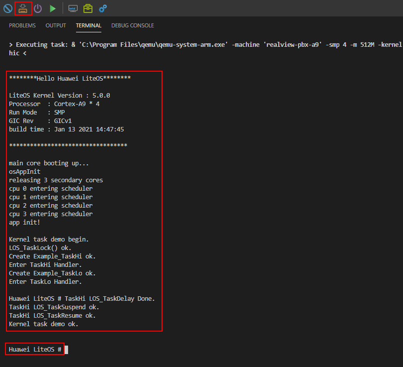

# Running

Huawei LiteOS Studio uses the burning function to start the QEMU VM and run Huawei LiteOS. For details about how to configure the burner and run Huawei LiteOS, see  [Starting the realview-pbx-a9 Emulation Project](https://liteos.gitee.io/liteos_studio/#/project_stm32?id=realview-pbx-a9%e6%89%a7%e8%a1%8cqemu%e4%bb%bf%e7%9c%9f). After the burning is successful, Huawei LiteOS is automatically started. The following information is displayed on the  **TERMINAL**  screen. Press  **Enter**  to enter the shell CLI window \(the  **Huawei LiteOS \#**  prompt is displayed\).

By default, the shell component of Huawei LiteOS is enabled. You can enter the supported shell command after the  **Huawei LiteOS \#**  prompt on the  **TERMINAL**  screen to run the shell command, as shown in the following figure. If you want to rebuild the system, exit the shell CLI window first.

For more information about the shell function, see  [Shell User Guide](https://gitee.com/LiteOS/LiteOS/blob/master/shell/README_EN.md).

